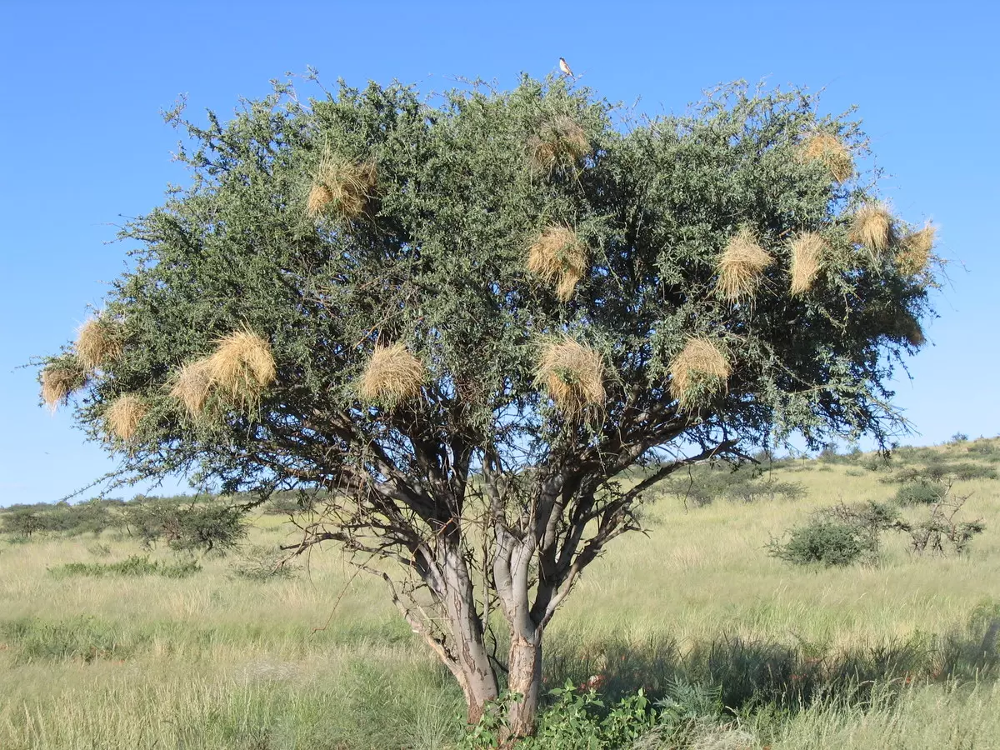

```{r setup, message=FALSE, warning=FALSE}
library(tidyverse)
library(lme4)
library(lmerTest)   # adds p-values to lmer summaries
```

# The idea

In the previous practical, we learned to think in terms of **one modelling framework**:

```r
glm(
  Response ~ Predictors,
  family = ...
)
```

**Sections with red titles are extras** They go a little beyond what you need for the main practical, so don’t worry if you do not follow every detail.

Now we add one more question:

> **Are my observations independent?**

If they are, a GLM may be appropriate.

If they are not, we may need a **mixed-effects model**.

We don't need a completely new type of model. We simply extend the model we already know.

```r
Response ~ Predictors + (1 | Group)
```

---

```{r nest-photo, echo=FALSE, fig.align="center", out.width="70%"}



```

# Our biological question

Imagine we want to know:

> **Does sparrow weaver nest height affect nest temperature?**

We visit **10 trees**. Each tree has **6 nests**, and we measure the height and temperature of every nest once.

So we have:

- 60 nest measurements
- but only 10 trees

The data below are simulated for teaching. Importantly, they contain a **hidden tree-level driver**: canopy cover differs among trees, and denser canopy makes trees cooler. Because average nest height also differs among trees, canopy cover creates an apparent relationship between nest height and temperature when tree structure is ignored.

We will initially pretend that canopy cover was **not measured**, and discover what the random effect does with this hidden variation. Later we will add canopy cover back into the model.

```{r create-data}
# Average nest height differs among trees
tree_mean_height <- seq(2, 5, length.out = 10)

# Nest heights also vary within each tree
within_tree_height <- c(-0.60, -0.36, -0.12,
                         0.12,  0.36,  0.60)

# A tree-level variable: canopy cover (%)
canopy_cover <- seq(20, 80, length.out = 10)

# Trees differ slightly for additional reasons we did not measure
tree_noise <- c(0.25, -0.20, 0.10, -0.15, 0.20,
               -0.10,  0.15, -0.25, 0.05, -0.05)

# Denser canopy makes trees cooler
tree_effect <- 5 - 0.10 * canopy_cover + tree_noise

# Small nest-to-nest variation
nest_noise <- c(0.20, -0.30, 0.10,
               -0.20,  0.25, -0.05)

nest_data <- expand_grid(
  Tree = 1:10,
  Nest = 1:6
) %>%
  mutate(
    Height = tree_mean_height[Tree] + within_tree_height[Nest],
    CanopyCover = canopy_cover[Tree],
    Temperature = 25 + tree_effect[Tree] + nest_noise[Nest],
    Tree = factor(Tree)
  )

nest_data
```

---

# Are our observations independent?

At first glance, we have **60 observations**.

But are they really 60 independent observations?

But the 60 nests are not all equivalent independent replicates.

Nests from the same tree share:

- canopy cover
- local shade
- tree architecture
- exposure
- local microclimate

So six nests on Tree 1 are not the same as six nests on six different trees.

This is **non-independence**. If we ignore it and pretend all 60 nests are independent, we create **pseudoreplication**.

---

# Step 1: Fit the model as if all nests were independent

From the previous practical, we know how to fit a Gaussian GLM:

```{r naive-model}
model_naive <- glm(
  Temperature ~ Height,
  family = gaussian,
  data = nest_data
)

summary(model_naive)
```

The model suggests a very strong relationship between nest height and temperature.

Before interpreting it, look at the data:

```{r naive-plot}
ggplot(nest_data, aes(Height, Temperature)) +
  geom_point() +
  geom_smooth(method = "lm")
```

It certainly looks as if higher nests are cooler.

If we stopped here, we might conclude:

> **Nest height strongly affects temperature.**

But now ask the key question:

> **Are these observations independent?**

---

# Step 2: Look at the sampling structure

Colour the same observations by tree:

```{r tree-plot}
ggplot(nest_data,
       aes(Height, Temperature,
           colour = Tree)) +
  geom_point()
```

Now the pattern looks quite different.

Within each tree, there is almost no relationship between nest height and temperature.

Instead, some **trees are generally warmer** and some **trees are generally cooler**.

The apparent overall relationship arises because:

- cooler trees tend to have higher nests
- warmer trees tend to have lower nests

The naïve GLM cannot distinguish those two sources of variation.

---

# Step 3: Add tree as a random effect

We now tell the model that nests from the same tree belong together.

```{r mixed-model}
model_mixed <- lmer(
  Temperature ~ Height + (1 | Tree),
  data = nest_data
)

summary(model_mixed)
```

The important new term is:

```r
(1 | Tree)
```

This means:

> **Allow each tree to have its own baseline temperature.**

The model still asks whether **Height** affects temperature, but it no longer pretends that all nests are independent.

---

# What changed?

Compare the estimated height effect:

```{r compare-models}
tibble(
  Model = c("Naive GLM", "Mixed model"),
  HeightEstimate = c(
    coef(model_naive)["Height"],
    fixef(model_mixed)["Height"]
  )
)
```

And compare the model summaries:

```{r compare-summaries}
summary(model_naive)
summary(model_mixed)
```

In the naïve GLM, height appears to have a very strong effect.

Once we account for tree identity, the height effect is essentially gone.

The important lesson is:

> **The 60 observations gave us lots of measurements, but they did not give us 60 independent trees.**

---

# Why did the result change?

The naïve GLM only sees one overall pattern:

> Taller nests are cooler.

The mixed model separates this into:

- differences **among trees**
- differences **within trees**

In this example, almost all of the apparent relationship occurs among trees. Once we account for tree identity, there is very little evidence that nest height itself affects temperature.

---

# Fixed effects and random effects

A useful way to think about them is:

| Type | Role in the model | Example |
|:---|:---|:---|
| **Fixed effect** | A variable whose effect we want to estimate | Nest height, canopy cover |
| **Random effect** | A grouping structure that allows observations from the same group to be correlated | Tree |

So here:

```r
Temperature ~ Height + (1 | Tree)
```

- `Height` is a fixed effect.
- `Tree` is the random effect.

The random effect is not just a statistical correction. It represents **unexplained differences among trees** that make nests from the same tree more similar to one another.

---

# What does the random effect tell us?

We can inspect the variation among trees:

```{r random-effect-variance}
VarCorr(model_mixed)
```

The tree-level variance tells us how much the **baseline temperature differs among trees**, after accounting for nest height.

A larger value means that trees still differ strongly from one another for reasons not explained by the fixed effects in the model.

You can also inspect the estimated tree effects:

```{r random-effects}
ranef(model_mixed)$Tree
```

Some trees are estimated to be generally warmer than average and others cooler than average.

But this raises an important biological question:

> **Why do the trees differ?**

---

# Can a fixed effect explain the random-effect variance?

This is the key to understanding what the random effect was doing in our example.

Remember that when we created the simulated data, trees differed in **canopy cover**. Trees with denser canopy were cooler. Average nest height also differed among trees.

When we fitted:

```r
Temperature ~ Height + (1 | Tree)
```

we deliberately **left canopy cover out**.

The model therefore did not know *why* Tree 1 was warmer than Tree 8. It simply allowed the trees to have different baseline temperatures through `(1 | Tree)`.

In other words, the random effect absorbed tree-level variation caused partly by the **hidden canopy-cover effect**.

Now look at canopy cover:

```{r canopy-plot}
ggplot(nest_data, aes(CanopyCover, Temperature)) +
  geom_point() +
  geom_smooth(method = "lm")
```

And add it as a fixed effect:

```{r canopy-model}
model_canopy <- lmer(
  Temperature ~ Height + CanopyCover + (1 | Tree),
  data = nest_data
)

summary(model_canopy)
```

Compare the random-effect variance before and after adding canopy cover:

```{r compare-variance}
VarCorr(model_mixed)
VarCorr(model_canopy)
```

The variance attributed to `Tree` becomes much smaller.

Why?

Because we have now explained a large part of **why trees differ in temperature**. Variation that previously appeared as unexplained differences among trees can now be attributed to canopy cover.

> **Random-effect variance is variation among groups that remains unexplained by the fixed effects in the model.**

This also explains the misleading result from the naïve GLM. Nest height itself did not create the strong temperature pattern. Trees differed in canopy cover, canopy cover affected temperature, and average nest height also differed among trees. Ignoring the grouping structure mixed these sources of variation together.

---

# When should I think about random effects?

Ask whether several observations share the same sampling unit.

| If you sampled... | A possible random effect |
|:---|:---|
| Several nests on the same tree | `Tree` |
| Several trees within the same site | `Site` |
| Repeated measurements on the same animal | `Individual` |
| Repeated detections from the same camera | `Camera` |
| Several plots within a larger block | `Block` |
| Repeated observations in the same year | `Year` |

The principle is:

> **Observations that belong to the same group may be more similar to each other than observations from different groups.**

---

# <span style="color:#C00000">What if the sampling design is nested?</span>
Sometimes there is more than one level of grouping.

Imagine that we measure several nests on each tree, and several trees occur within each site:

```text
Site
 └── Tree
      └── Nest measurements
```

Trees are **nested within sites**. We can write:

```r
(1 | Site/Tree)
```

which expands to:

```r
(1 | Site) + (1 | Site:Tree)
```

This allows sites to have different baseline temperatures, and trees within those sites to differ further.

> **Use nested random effects when one grouping unit genuinely occurs within another grouping unit.**

A small but important notation point: if `Tree` is nested within `Site`, the order is `(1 | Site/Tree)`, **not** `(1 | Tree/Site)`.

---

# <span style="color:#C00000">Random intercepts vs. random slopes</span>

So far we have used a **random intercept**:

```r
(1 | Tree)
```

This allows each tree to have a different baseline temperature.

Sometimes we may also expect the **effect of a predictor** to differ among groups. For example:

```r
(Height | Tree)
```

This is shorthand for:

```r
(1 + Height | Tree)
```

It allows each tree to have its own baseline temperature **and** its own relationship between height and temperature.

This is a **random-slope model**. You probably will not need one for the field-course projects, but it is useful to recognise the notation.

Do not confuse this with nesting. `(Height | Tree)` does **not** mean that Height is nested within Tree; it means that the effect of Height is allowed to vary among trees.

---

# Testing and reporting the results

As in the first practical, fitting the model and **testing a biological effect** are separate steps.

For these Gaussian mixed models, the `lmerTest` package gives approximate p-values for the fixed effects in the model summary:

```{r mixed-significance}
summary(model_mixed)
```

For the height effect, the important part is the `Height` row under **Fixed effects**. It gives the estimated effect, its standard error, a *t* statistic, and a *p*-value.

The main reporting rule is the same as before:

> **Describe the biological result first, then give the statistical evidence.**

For example, we can extract the actual result from our model:

```{r mixed-report-values, echo=FALSE}
mixed_tab <- coef(summary(model_mixed))
height_est <- mixed_tab["Height", "Estimate"]
height_se  <- mixed_tab["Height", "Std. Error"]
height_df  <- mixed_tab["Height", "df"]
height_t   <- mixed_tab["Height", "t value"]
height_p   <- mixed_tab["Height", "Pr(>|t|)"]

p_text <- function(p) {
  if (is.na(p)) return("NA")
  if (p < 0.001) return("< 0.001")
  paste0("= ", format(round(p, 3), nsmall = 3))
}
```

**How would I report this?**

> After accounting for differences among trees, nest height was not associated with nest temperature (linear mixed-effects model: β = `r round(height_est, 2)` ± `r round(height_se, 2)` SE, *t*~`r round(height_df, 1)`~ = `r round(height_t, 2)`, *p* `r p_text(height_p)`).

Notice that we do **not** simply write "the effect was non-significant". We say what biological relationship was tested and then report the statistical evidence.

Now consider the model in which we measured canopy cover and added it as a fixed effect:

```{r canopy-report-values, echo=FALSE}
canopy_tab <- coef(summary(model_canopy))
canopy_est <- canopy_tab["CanopyCover", "Estimate"]
canopy_se  <- canopy_tab["CanopyCover", "Std. Error"]
canopy_df  <- canopy_tab["CanopyCover", "df"]
canopy_t   <- canopy_tab["CanopyCover", "t value"]
canopy_p   <- canopy_tab["CanopyCover", "Pr(>|t|)"]
```

**How would I report this?**

> Trees with denser canopy were cooler (linear mixed-effects model: β = `r round(canopy_est, 2)` ± `r round(canopy_se, 2)` SE, *t*~`r round(canopy_df, 1)`~ = `r round(canopy_t, 2)`, *p* `r p_text(canopy_p)`). Adding canopy cover also substantially reduced the unexplained variance among trees.

That last sentence is biologically important: the fixed effect helps explain **why the groups differed**.

## <span style="color:#C00000">Comparing mixed models with AIC</span>
We can also compare competing biological models using AIC, just as in the first practical.

There is one important technical point for `lmer()`. By default, `lmer()` fits models using **REML** (`REML = TRUE`). If two models differ in their **fixed effects**, their REML-based AIC values should not be compared directly. Refit them using maximum likelihood:

```{r mixed-aic}
model_mixed_ML <- lmer(
  Temperature ~ Height + (1 | Tree),
  data = nest_data,
  REML = FALSE
)

model_canopy_ML <- lmer(
  Temperature ~ Height + CanopyCover + (1 | Tree),
  data = nest_data,
  REML = FALSE
)

AIC(model_mixed_ML, model_canopy_ML)
```

The model with the lower AIC has more support, after balancing model fit against model complexity.

```{r mixed-aic-report, echo=FALSE}
aic_tab <- AIC(model_mixed_ML, model_canopy_ML)
aic_height <- aic_tab["model_mixed_ML", "AIC"]
aic_canopy <- aic_tab["model_canopy_ML", "AIC"]
delta_aic <- aic_height - aic_canopy
```

**How would I report this?**

> The model including canopy cover was better supported than the model containing nest height alone (ΔAIC = `r round(delta_aic, 1)`), suggesting that canopy cover explains important variation in nest temperature among trees.

For this course, the main thing to remember is simple:

```text
p-values  -> evidence for particular fixed effects
AIC       -> comparison of competing models
```

> **If you compare `lmer()` models with different fixed effects using AIC, fit them with `REML = FALSE`.**

Adding a random effect itself is not a significance-testing trick. It is about representing the sampling design correctly.

---

# <span style="color:#C00000">A brief note about diagnostics</span>

As with the GLMs in the first practical, a fitted mixed model should be checked before we trust it.

For a simple Gaussian mixed model, start by looking at the residuals:

```{r mixed-diagnostics}
plot(model_mixed)
qqnorm(resid(model_mixed))
qqline(resid(model_mixed))
```

With more complicated generalized mixed models (`glmer()`), especially Binomial or Poisson models, packages such as **DHARMa** can be useful.

---

# The roadmap

The roadmap from the first practical still works. We have simply expanded the third question.

| Question | Why does it matter? |
|:---|:---|
| **What is my response?** | Chooses the model family. |
| **What are my predictors?** | Defines the fixed effects in the model. |
| **Are the observations independent?** | Determines whether random effects may be needed. |
| **How will I compare models?** | p-values or AIC, depending on the question. |

The basic progression is therefore:

```text
Response ~ Predictors
```

and, when observations belong to groups:

```text
Response ~ Predictors + (1 | Group)
```

---

# Final message

In the first practical, we learned to think about **models rather than separate statistical tests**.

Here we added one more idea: the model should also represent **how the data were collected**.

If observations from the same tree, animal, camera, site, or other sampling unit are not independent, we can represent that grouping with a random effect:

```r
Response ~ Predictors + (1 | Group)
```

The random effect allows groups to differ from one another. If we later measure a biological variable that explains those differences, adding it as a fixed effect may reduce the unexplained random-effect variance.

And remember:

> **More measurements within the same groups give us more information about those groups, but they do not create new independent groups.**

---
